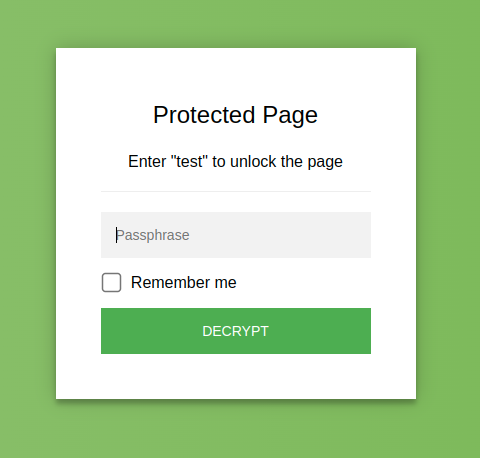

<p align="center"><a href="https://robinmoisson.github.io/staticrypt/example/encrypted/example.html"></a><a href="https://robinmoisson.github.io/staticrypt/example/encrypted/example.html"><br/>live example</a></p>

# StatiCrypt

Safely encrypt and password protect the content of your _public_ static HTML file, to be decrypted in-browser without any back-end - to serve it over static hosting like Netlify, GitHub pages, etc. (see [a live example](https://robinmoisson.github.io/staticrypt/example/encrypted/example.html)).

StatiCrypt uses AES-256 and WebCrypto to encrypt your HTML file with your long password, and returns a static HTML page showing a password prompt that you can now safely upload anywhere, the page containing your encrypted content and decryption happening in javascript client side (see the details of [how it works](#how-staticrypt-works)).

👉️ You can encrypt a file online in your browser (client side) at [robinmoisson.github.io/staticrypt](https://robinmoisson.github.io/staticrypt), or use the CLI to do it in your terminal or build process.

> 🌱 **Supporting:** If you want to support StatiCrypt development you can do so by clicking on the sponsor button (you can also [come study meditation](https://robinmoisson.com/en/) with me, or use my other tool to [translate books](https://translateabook.com)). See [how donations are used](https://github.com/sponsors/robinmoisson). Thank you for your support!
>
> <a href="https://github.com/sponsors/robinmoisson"></a>

## CLI

**Migration:** v3 brings many improvements, a clearer CLI and simpler `password_template` over v2. See the [migration guide from v2 to v3](MIGRATING.md). v3 uses WebCrypto which is only available in HTTPS or localhost contexts, so if you need to use it in HTTP you'll need to use v2.

### Installation

Staticrypt is available through npm as a CLI, install with

```bash
npm install staticrypt
```

You can then run it with `npx staticrypt ...`. You can also install globally with `npm install -g staticrypt` and then just call `staticrypt ...` from anywhere.

### Examples

> These examples will create a `.staticrypt.json` file in the current directory ([here's why](#why-does-staticrypt-create-a-config-file)). This file isn't secret and you don't need to protect it. You can prevent this by setting the `--config` flag to `false` (a string).

#### Encrypt a file

Encrypt `test.html` and create a `encrypted/test.html` file (use `-d my_directory` to change the output directory):

```bash
# this will prompt you for the password, which won't stay in your terminal command history
staticrypt test.html

# you can also pass the password as an argument
staticrypt test.html -p <long-password>
```

#### Encrypt a file with the password in an environment variable

Set your long password in the `STATICRYPT_PASSWORD` environment variable ([`.env` files](https://www.npmjs.com/package/dotenv#usage) are supported):

```bash
# the password is in the STATICRYPT_PASSWORD env variable, you won't be prompted
staticrypt test.html
```

#### Encrypt multiple HTML files at once

This will put the HTML files in an `encrypted` directory, created where you run the `staticrypt` command. Non-HTML files will be copied as-is from the input directory, so you can easily overwrite it with the encrypted directory if you want.

```bash
# this will encrypt test_A.html and test_B.html
staticrypt test_A.html test_B.html
# => encrypted files are in encrypted/test_A.html and encrypted/test_B.html

# you can also use the -r flag to recursively encrypt all files in a directory
staticrypt dir_to_encrypt -r
# => encrypted files are in encrypted/dir_to_encrypt/...

# if you don't want to include the directory name in the output path, you can use 
# `dir_to_encrypt/*` instead. `-r` will include potential subdirectories as well
staticrypt dir_to_encrypt/* -r
# => encrypted files are in encrypted/...
```

#### Replace all the files in a folder with encrypted ones

```bash
# 'dir_to_encrypt/*' as argument will select all the files in the directory ('-r' recursively), 
# and the '-d dir_to_encrypt' will put them in the same directory, overwriting the files
staticrypt dir_to_encrypt/* -r -d dir_to_encrypt
```

#### Get a shareable auto-decrypt link

The link contains the hashed password, that will auto-decrypt the file - you can include your file URL or leave blank. (⚠️ you should keep your `.staticrypt.json` so the salt is the same each time you encrypt, or re-encrypting will [invalidate the link](#why-does-staticrypt-create-a-config-file)): 

```bash
# you can also pass '--share' without specifying the URL to get the `#staticrypt_pwd=...` 
staticrypt test.html --share https://example.com/encrypted.html
# => https://example.com/encrypted.html#staticrypt_pwd=5bfbf1343c7257cd7be23ecd74bb37fa2c76d041042654f358b6255baeab898f

# add --share-remember to auto-enable "Remember-me" - useful if you want send one link to 
# autodecrypt multiple pages (you can also just append '&remember_me')
staticrypt test.html --share --share-remember
# => #staticrypt_pwd=5bfbf1343c7257cd7be23ecd74bb37fa2c76d041042654f358b6255baeab898f&remember_me
```

#### Pin the salt to use staticrypt in your CI or build step

If you want want the "Remember-me" or share features to work accross multiple pages or multiple successive deployment, the salt needs to stay the same ([see why](https://github.com/robinmoisson/staticrypt#why-does-staticrypt-create-a-config-file)). If you run StatiCrypt in a CI step, you can pin the salt in two ways:

- either commit the `.staticrypt.json` config file - you can generate a random salt and config file on your local machine with:

    ```bash
    staticrypt --salt
    ```
  
- or hardcode the salt in the encryption command in the CI script:

    ```bash
    staticrypt test.html --salt 12345678901234567890123456789012
    ```

> See an example of how to use StatiCrypt in a CI build step in this community project: [a-nau/password-protected-website-template](https://github.com/a-nau/password-protected-website-template)

#### Customize the password prompt

Customize the HTML to have the encrypted page match your style (see [the FAQ](#can-i-customize-the-password-prompt) for a full custom template):

```bash
# use your own custom template
staticrypt test.html -t my/own/password_template.html

# or customize the default template
staticrypt test.html \
    --template-color-primary "#fd45a4" \
    --template-title "My custom title" \
    --template-instructions "To unlock this file, you should..." \
    # ...
```

#### Decrypt files from the CLI

Decrypt files you encrypted earlier with StatiCrypt straight from the CLI by including the `--decrypt` flag. (So if you want, you can keep only the encrypted files.) The `-r|--recursive` flag and output `-d|--directory` option work the same way as when encrypting (default name for the output directory is `decrypted`):

```bash
staticrypt encrypted/test.html --decrypt
# => decrypted file is in decrypted/test.html
```

### CLI Reference

The password argument is optional if `STATICRYPT_PASSWORD` is set in the environment or `.env` file.

    Usage: staticrypt <filename> [<filename> ...] [options]

    Options:
          --help                      Show help                            [boolean]
          --version                   Show version number                  [boolean]
      -c, --config                    Path to the config file. Set to "false" to
                                      disable.[string] [default: ".staticrypt.json"]
      -d, --directory                 Name of the directory where the generated
                                      files will be saved. If the '--decrypt' flag
                                      is set, default will be 'decrypted'.
                                                     [string] [default: "encrypted"]
          --decrypt                   Include this flag to decrypt files instead of
                                      encrypt.            [boolean] [default: false]
      -p, --password                  The password to encrypt your file with. Leave
                                      empty to be prompted for it. If
                                      STATICRYPT_PASSWORD is set in the env, we'll
                                      use that instead.     [string] [default: null]
      -r, --recursive                 Whether to recursively encrypt the input
                                      directory.          [boolean] [default: false]
          --remember                  Integer: expiration in days of the "Remember 
                                      me" checkbox that will save the (salted + 
                                      hashed) password in localStorage when entered 
                                      by the user. Set to "false" to hide the box. 
                                      Default: "0", no expiration.      [default: 0]
      -s, --salt                      Generate a config file or set the salt
                                      manually. Pass a 32-character-long hexadecimal
                                      string to use as salt, or leave empty to
                                      generate, display and save to config a random
                                      salt. This won't overwrite an existing config
                                      file.                                 [string]
          --share                     Get a link containing your hashed password
                                      that will auto-decrypt the page. Pass your URL
                                      as a value to append
                                      "#staticrypt_pwd=<hashed_pwd>", or leave empty
                                      to display the hash to append.        [string]
          --share-remember            Whether the share link should auto-enable
                                      'Remember-me'.      [boolean] [default: false]
          --short                     Hide the "short password" warning.
                                                          [boolean] [default: false]
      -t, --template                  Path to custom HTML template with password
                                      prompt.
                   [string] [default: "/code/staticrypt/lib/password_template.html"]
          --template-button           Label to use for the decrypt button. Default:
                                      "DECRYPT".       [string] [default: "DECRYPT"]
          --template-color-primary    Primary color (button...)
                                                       [string] [default: "#4CAF50"]
          --template-color-secondary  Secondary color (page background...)
                                                       [string] [default: "#76B852"]
          --template-instructions     Special instructions to display to the user.
                                                              [string] [default: ""]
          --template-error            Error message to display on entering wrong
                                      password.  [string] [default: "Bad password!"]
          --template-placeholder      Placeholder to use for the password input.
                                                      [string] [default: "Password"]
          --template-remember         Label to use for the "Remember me" checkbox.
                                                   [string] [default: "Remember me"]
          --template-title            Title for the output HTML page.
                                                [string] [default: "Protected Page"]
          --template-toggle-hide      Alt text for toggling password visibility -
                                      "hide" action.
                                                 [string] [default: "Hide password"]
          --template-toggle-show      Alt text for toggling password visibility -
                                      "show" action.
                                                 [string] [default: "Show password"]


## HOW STATICRYPT WORKS

So, how can you password protect html without a back-end?

StatiCrypt uses WebCrypto to generate a static, password protected page that can be decrypted in-browser. You can then just send or upload the generated page to a place serving static content (github pages, for example) and you're done: the page will prompt users for a password, and the javascript will decrypt and load your HTML, all done in the browser.

So it basically encrypts your page and puts everything in a user-friendly way to enter the password in the new file.

## FAQ

### Is it secure?

Simple answer: your file content has been encrypted with AES-256, a popular and strong encryption algorithm. You can now upload it to any public place and no one will be able to read it without the password. So if you used a long, strong password, then yes it should be secure.

Longer answer: actual security depends on a number of factors and on the threat model you want to protect against. Because your full encrypted file is accessible client side, brute-force/dictionary attacks would be easy to do at a fast pace: **use a long, unusual password**. We recommend 16+ alphanum characters, [Bitwarden](https://bitwarden.com/) is a great open-source password manager if you don't have one already.

On the technical aspects: we use AES in CBC mode (see a discussion on why this mode is appropriate for StatiCrypt in [#19](https://github.com/robinmoisson/staticrypt/issues/19)) and key stretching with 600k PBKDF2-SHA256 iterations to slow down brute-force attacks (which is the [recommended number](https://cheatsheetseries.owasp.org/cheatsheets/Password_Storage_Cheat_Sheet.html#pbkdf2) by OWASP - read a detailed report on why this number and the security model of StatiCrypt in [#159](https://github.com/robinmoisson/staticrypt/issues/159)).

**Transparency disclaimer:** I am not a cryptographer. I try my best to get the implementation right, listen to feedback and be transparent in stewarding StatiCrypt. But please adjust accordingly depending on your threat model: if you are an at-risk activist or have very sensitive crypto assets to protect, you might want to use something else.

### Can I customize the password prompt?

Yes! Just copy `lib/password_template.html`, modify it to suit your style and point to your template file with the `-t path/to/my/file.html` flag. 

Be careful to not break the encrypting javascript part, the variables replaced by StatiCrypt are in this format: `/*[|variable|]*/0`. Don't leave out the `0` at the end, this weird syntax is to avoid conflict with other templating engines while still being read as valid JS to parsers so we can use auto-formatting on the template files. Prettier will add a space before the `0` if the variable is in a JS section  - this isn't very pretty but it won't break the templating engine so don't worry about it (if you want to add a prettier plugin that will avoid this behavior, feel free to open a PR!).

### Can I support multiple users with different passwords?

At the moment you can only use one passsword per page (though there is a reflection on supporting decryption with multiple different passwords in [#158](https://github.com/robinmoisson/staticrypt/issues/158)). If you want to support multiple users so you can invalidate passwords individualy, the current recommended way is the following:

- Make a script that will encrypt your files with different passwords and different output folders

  ```
  staticrypt test.html -p <john-password> -d john
  ...
  ```
  
- send each user the link to their folder with their password: `https://example.com/john/test.html`

In a way, the username input becomes the folder in the `https://example.com/<username>` URL, and the password input is the HTML form. You can then invalidate a single password by changing it in your script and running it again. 

### Why doesn't StatiCrypt work in HTTP?

From version 3.x StatiCrypt only uses the browser WebCrypto API, which makes it more secure but is only available in HTTPS or on localhost. If you need to use it in HTTP, you can use version 2.x which offers the CryptoJS engine as an option, and will work everywhere.

### Why does StatiCrypt create a config file?

The "Remember me" feature stores the user password hashed and salted in the browser's localStorage, so it needs the salt to be the same each time you encrypt otherwise the user would be logged out when you encrypt the page again. The config file is a way to store the salt in between runs, so you don't have to remember it and pass it manually.

When deciding what salt to use, StatiCrypt will first look for a `--salt` flag, then try to get the salt from the config file, and if it still doesn't find a salt it will generate a random one. It then saves the salt in the config file.

If you don't want StatiCrypt to create or use the config file, you can set `--config false` to disable it.

The salt isn't secret (it's publicly visible on the encrypted file), so you don't need to worry about hiding the config file. If you're encrypting as part of a CI step, you can commit the `.staticrypt.json` file so it's accessible to your build server.

### How does the "Remember me" checkbox work?

The CLI will add a "Remember me" checkbox on the password prompt by default (`--remember false` to disable). If the user checks it, the (salted + hashed) password will be stored in their browser's localStorage and the page will attempt to auto-decrypt when they come back.

If no value is provided the stored password doesn't expire, you can also give it a value in days for how long should the store value be kept with `--remember NUMBER_OF_DAYS`. If the user reconnects to the page after the expiration date the stored value will be cleared.

#### "Logging out"

You can clear StatiCrypt values in localStorage (effectively "logging out") at any time by appending `staticrypt_logout` to the URL fragment (`https://mysite.com#staticrypt_logout`).

#### Encrypting multiple pages

This allows encrypting multiple page on a single domain with the same password: if you check "Remember me", you'll have to enter your password once then all the pages on that domain will automatically decrypt their content. Because the hashed value is stored in the browser's localStorage, this will only work if all the pages are on the same domain name.

#### Is the "Remember me" checkbox secure?

In case the value stored in the browser becomes compromised an attacker can decrypt the page, but because it's stored salted and hashed this should still protect against password reuse attacks if you've used the password on other websites (of course, please use a long, unique password nonetheless).

#### Can I remove the "Remember me" checkbox?

If you don't want the checkbox to be included, you can set the `--remember false` flag to disable it.

## Contributing

### 🙏 Thank you!

- [@AaronCoplan](https://github.com/AaronCoplan) for bringing the CLI to life
- [@epicfaace](https://github.com/epicfaace) & [@thomasmarr](https://github.com/thomasmarr) for sparking the caching of the password in localStorage, allowing the "Remember me" checkbox
- [@hurrymaplelad](https://github.com/hurrymaplelad) for refactoring a lot of the code and making the project much more pleasant to work with
- [@hurrymaplelad](https://github.com/hurrymaplelad) and [@tarpdalton](https://github.com/tarpdalton) for their work in bringing WebCrypto to StatiCrypt

### Opening PRs and issues

I administer the project when I have time and motivation. You're free to open PRs if you're ok with having no response for a (possibly very) long time and me possibly ending up getting inspiration from your proposal but merging something different myself (I'll try to credit you though). Apologies in advance for the delay, and thank you for making the project better!

Opening issues with suggestions and bug reports is welcome.

If you find a serious security bug please open an issue or contact me following the instructions in [SECURITY.md](SECURITY.md) and I'll try to fix it relatively quickly.

### Security

You can find the security policy and secure contact details in [SECURITY.md](SECURITY.md). If you have general ideas or feedback around the implementation or StatiCrypt security model they are very welcome, if it's not extra sensitive feel free to open an issue. A couple of place where security was discussed previously are [#19](https://github.com/robinmoisson/staticrypt/issues/19) and [#159](https://github.com/robinmoisson/staticrypt/issues/159).

### Guidelines to contributing

#### Source map

- `cli/` - The command-line interface published to NPM.
- `example/` - Example encrypted files, used as an example in the public website and for manual testing.
- `lib/` - Files shared across www and cli.
- `scripts/` - Convenient scripts for building the project.
- `index.html` - The root of the in-browser encryption site hosted at https://robinmoisson.github.io/staticrypt. Kept in the root of the repo for easy deploys to GitHub Pages.

#### Build

When editing StatiCrypt logic, we want to sync the changes to the browser version, the CLI and the example files, so all of them use the new logic. To do so, run:  

```
npm install
npm run build
```

#### Test

The testing is done manually for now - you can run [build](#build), then open `example/encrypted/example.html` and check everything works correctly. There is an open issue to automate this in [#136](https://github.com/robinmoisson/staticrypt/issues/136), feel free to contribute to setting up a test framework if you'd like!

## Community and alternatives

Here are some other projects and community resources you might find interesting. **This is included as an informative section only, I haven't personally vetted any of those.** 

If you have a StatiCrypt project you'd like to share, feel free to open an issue describing it - I'll probably be happy to add it to the list!

### Based on StatiCrypt, tutorials and projects

**Template to host an encrypted single page website with Github Pages:** [a-nau/password-protected-website-template](https://github.com/a-nau/password-protected-website-template) is a demonstration of how to build a protected page on Github Pages, integrating with Github Actions.

### Alternatives to StatiCrypt

(I haven't vetted any of those beyond a quick look, use at your own discretion)

- [mprimi/portable-secret](https://github.com/mprimi/portable-secret) is a similar project that supports files and looks awesome
- [dividuum/html-vault](https://github.com/dividuum/html-vault) is a similar project which aims as being as tiny as possible to be really easy to audit
- [MaxLaumeister/PageCrypt](https://github.com/MaxLaumeister/PageCrypt) is a project with similar features in a different style (I think it was created before StatiCrypt).
- [sowbug/quaid](https://github.com/sowbug/quaid) was described by its author as "Similar (but also for a narrower use case with fewer features). It wraps a JS implementation of only the decryption side of GPG symmetric encryption, so there's less opportunity for the tool itself to introduce security errors."
- [Izumiko/hugo-encrypt](https://github.com/Izumiko/hugo-encrypt) is a go tool to encrypt Hugo pages with good documentation that allows you to do similar things.
